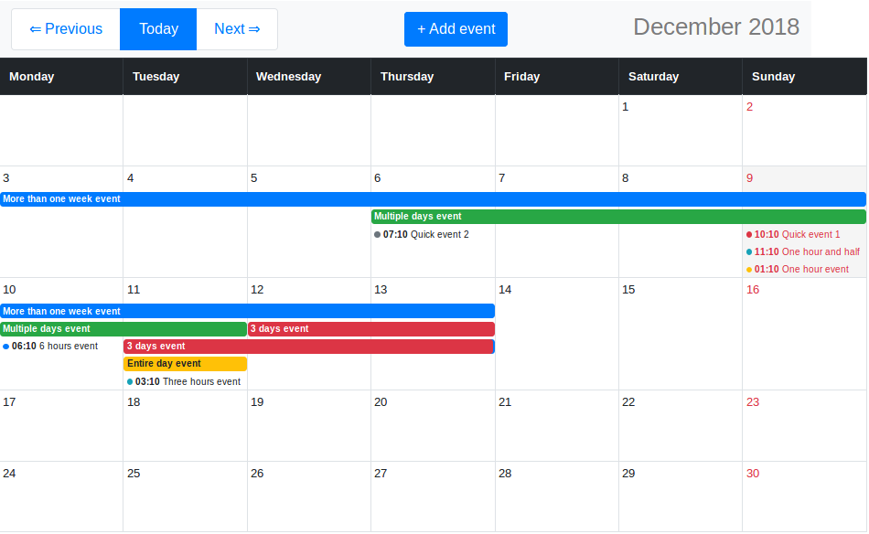

# react-event-calendar [](https://travis-ci.org/lzakrzewski/react-monthly-events) [](https://badge.fury.io/js/react-monthly-events)

## A monthly calendar view component for React
A [Bootstrap 4](https://getbootstrap.com/) based [React](https://reactjs.org/) component to display calendar with scheduled events for given month.



## Features
- Monthly calendar view
- Can display different types of events (events on exact date, time range events)
- Modern styling and layout ([Bootstrap 4](https://getbootstrap.com/))

## Installation 
`npm install react-monthly-events`

## Demo 
Online demo is available!
[https://react-monthly-events.herokuapp.com/](https://react-monthly-events.herokuapp.com/)  
(The first load of the page can take a while due to heroku limitations.)

## Working example
You can quickly setup this calendar component on your local machine and see how it works:
[lzakrzewski/react-monthly-events-sandbox](https://github.com/lzakrzewski/react-monthly-events-sandbox)

## Basic usage 
```jsx harmony
import React, { Component } from 'react';
import MonthlyEvents from 'react-monthly-events';

class YourComponent extends Component {
    render() {
        const currentMonth = new Date('2017-01-01');
        const events = [
            { id: 'event-1', start: '2017-02-01', allDay: false, event: 'Learn ReactJS' },
            { id: 'event-2', start: '2017-02-01 00:01:00', end: '2017-02-17 00:01:00', allDay: false, event: 'Go home' },
        ];
        
        return (
            <div className="row">
                <MonthlyEvents
                    currentMonth={ currentMonth }
                    events={ events }
                />
            </div>
        );
    }
}
```

#### The arguments of component
- `currentMonth` indicates a month to display. For example if you want to display the calendar page for February 2017 you need to provide any date between "2017-02-01" and "2017-02-28".
It can be string, an instance of moment or an instance of Date.
- `events` is an array of events to display. The component will filter out the all events for other months. 

#### The structure of event objects
| name    | description                              | type       | required |
|---------|------------------------------------------|------------|----------|
| id      | an unique identifier for an event string | string     | true     |
| start   | the date when the event starts           | ISO string | true     |
| event   | the date when the event starts           | ISO string | true     |
| allDay  | name of event                            | boolean    | true     |
| end     | the date when the event ends             | ISO string | false    |

```
{
    id: 'event-1',
    start: '2017-02-01',
    end: '2017-02-02',
    event: 'Learn ReactJS',
    allDay: false
}
```

## Dependencies
- Bootstrap: "4.x"
- "moment": "2.x",
- "lodash": "4.x",
- "react": "16.x"
    
